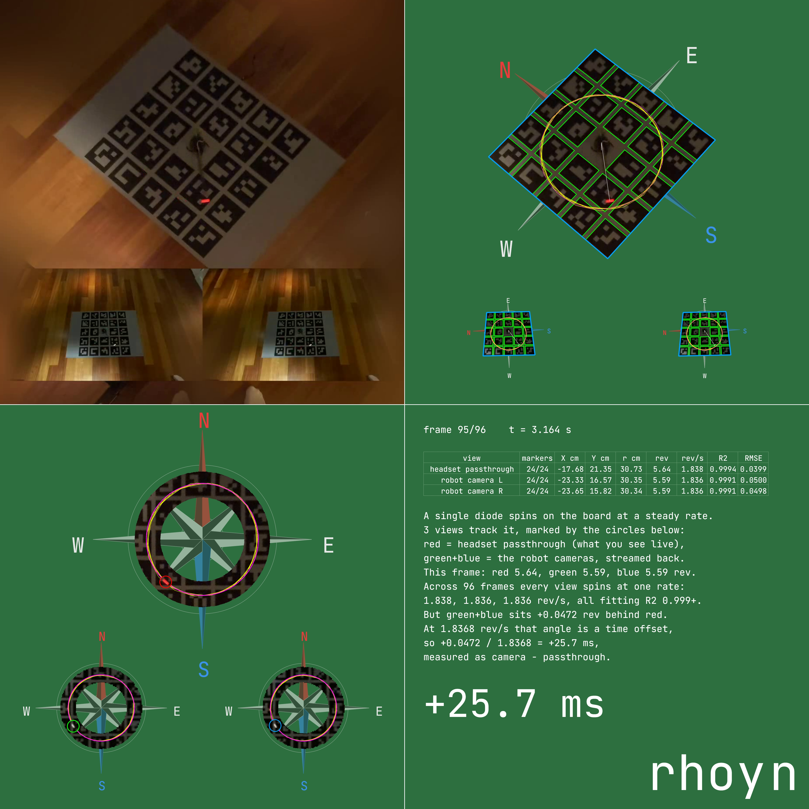
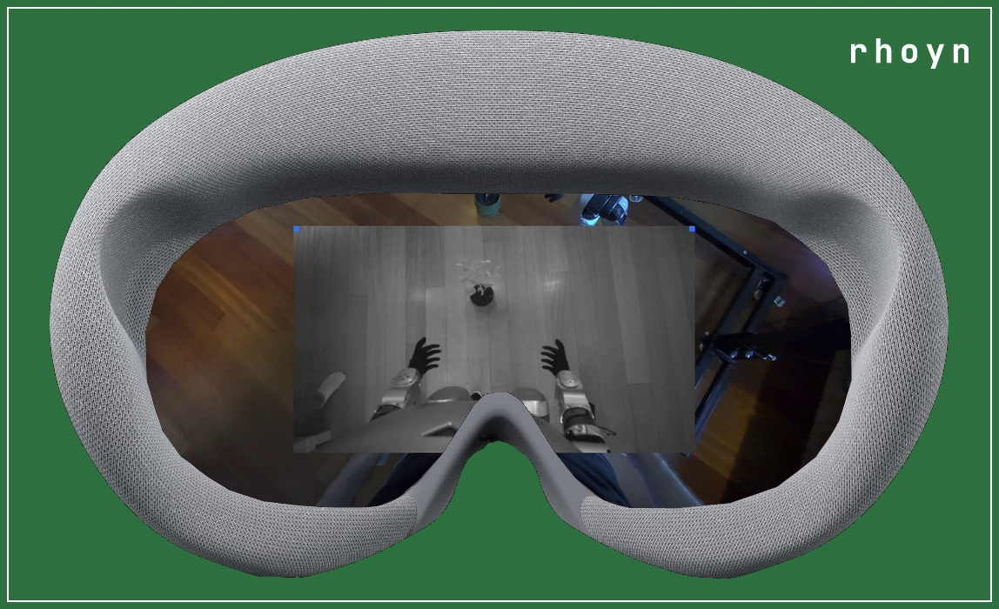
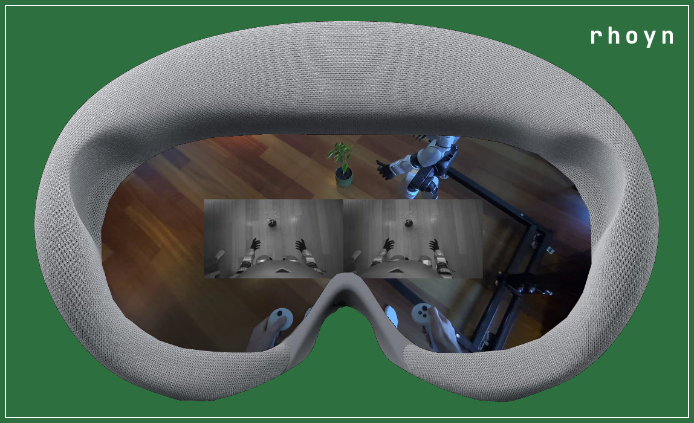

# teleop-camera-latency-analysis

Blog post: [Low latency eyes](https://rhoyn.com/low-latency-eyes?utm_source=github)



https://github.com/user-attachments/assets/50d515f3-5a79-4a9a-a9fb-55cd01d475e2

## Problem statement

This is what the operator sees while teleoperating the humanoid: the room in
front of them through the headset's own passthrough, with the robot's cameras
floating inside it. Both show the same scene from almost the same place, and
that is what makes the lag visible — move, and the robot's view of the move
arrives a little after the live one.



The robot feed is stereo, a separate image per eye, which is what gives it
depth and exactly what a flat screen cannot reproduce. It can be switched to a
side-by-side pair of the two eyes, which is what a screenshot can show:



Noticing the lag is not measuring it. For that the floor gets one printed ArUco
board with an LED on an arm spinning around its centre, and the session is
recorded through the headset. A single frame of that recording holds the whole
measurement:


That recording is what this software processes.

## What it measures

Measures end-to-end video latency of a teleoperation stack from a single
recording, by watching one physical spinning LED through every camera path at
once.

The program prints one number — the latency in milliseconds — on stdout, and
writes a four-panel video showing how it got there.

The number is signed, always as **camera minus passthrough**: positive means the
robot camera view is that far behind the live passthrough, negative means it is
that far ahead. A stream fast enough to tie with the headset's own passthrough
sits near zero and its sign will wander between clips, which is what a reading
below the method's noise floor looks like — treat a small number as "no
measurable difference", not as a confident lead.

## Capture rig

- `aruco_board_A0.pdf` — the marker board, printed at A0. It is a 5x5 grid
  from `DICT_4X4_50` with the centre marker omitted to leave room for the
  spinning arm's axle. The dimensions the program assumes are compiled in near
  the top of `main.cpp` (`BOARD_WIDTH_CM`, `MARKERS_PER_SIDE`, and the rest);
  if you print at a different size, change them to match.
- `rotating_diode/` — the spinning arm, as OpenSCAD source plus prebuilt STLs.
  `rotating_diode/run.sh` regenerates the STLs (whole, plus split left/right
  halves for smaller print beds). It carries a battery and a red LED, and the
  program expects the LED to orbit at `DIODE_ORBIT_RADIUS_CM`. The parts and
  the motor it spins on are listed in
  [rotating_diode/BOM.md](rotating_diode/BOM.md).

The arm's exact speed doesn't need to be known or held constant between runs —
it's measured from the video, and only has to be steady across a single clip.

## How it works

The subject is one printed ArUco board with an LED on an arm spinning around
its centre, and one frame of the headset recording holds that board twice over,
or three times for a stereo pair:

- the **headset passthrough** — the operator's own view of the room, as close
  to realtime as the headset gets, showing the LED roughly where it is now,
  and
- the **robot camera** preview floating in front of it (here a stereo
  **L**/**R** pair) — the same LED, but arriving over the teleoperation
  stack, so showing where it was some milliseconds ago.

One recorder, one instant, one physical LED. Nothing has to be instrumented
and no clocks have to be synchronised: the only thing separating the two
pictures of the board is the latency of the stream between them.

The LED spinning is what turns that separation into a number. Where the arm
points is a clock hand, and the two views are reading the same hand at
different moments, so the angle between them is the delay — once the arm's
speed is known, and that is measured from the video too.

For each frame the program fits the board pose from the ArUco markers, maps
the LED blob into board coordinates, and records its angle. Unwrapped over the
clip, each view's angle-versus-time is a straight line. All views share the
same angular speed — it's one physical LED — so the fitted lines differ only
in phase. Dividing that phase gap by the shared angular speed converts it into
time, and fitting over every frame rather than comparing frame to frame is
what averages the per-frame noise out.

Fitting the whole clip is also why the result has sub-frame resolution: the
measurement is not quantised to the recording's frame interval.

## Results

Every clip in `inputs/`, in milliseconds, signed as **camera minus
passthrough**: positive means the robot camera view sits that far behind the
live passthrough. Row `3` is `inputs/<stack>-3.mp4`, and its four-panel render
is `outputs/<stack>-3.mp4`.

| # | rhoyn | XRoboToolkit |
|---|---|---|
| 0 | -4.3 | +25.7 |
| 1 | -2.4 | +31.7 |
| 2 | +6.9 | +40.5 |
| 3 | -2.7 | +39.7 |
| 4 | +5.5 | +41.2 |
| 5 | -1.8 | +28.7 |
| 6 | -3.8 | +35.0 |
| 7 | +3.1 | +35.6 |
| **median** | **-2.1** | **+35.3** |
| **mean** | **+0.1** | **+34.8** |

### Comparison

| video stack | recordings | median latency | vs rhoyn |
|---|---|---|---|
| rhoyn Teleop + stock Unitree G1 D435 | 8 | **-2.1 ms** | — |
| XRoboToolkit Orin Video Sender + ZED Mini | 8 | **+35.3 ms** | **+37.4 ms slower** |

The two stacks do not overlap: rhoyn spans -4.3 to +6.9 ms and the alternative
+25.7 to +41.2 ms, so every rhoyn clip is ahead of every clip from the
alternative.

The last column is a difference rather than the "Nx slower" ratio the hands
analysis uses, because a ratio would be meaningless here. rhoyn's clips
straddle zero and their sign wanders between takes, which is exactly what a
stream fast enough to tie with the headset's own passthrough looks like — so
-2.1 ms means "no measurable difference", not a 2 ms lead, and dividing by a
figure sitting on the noise floor would manufacture a ratio out of nothing.
What the recordings do support is the gap: the alternative arrives about 37 ms
behind.

### How much lower

Pair every rhoyn clip with every clip from the alternative — 8 x 8, so 64
pairs — subtract, and take the median of the 64 differences. That number is
**34.7 ms**: the alternative's display latency is 34.7 ms higher than rhoyn's.

Both stacks were recorded the same way and measured by this program with the
same board and the same constants, so every one of those 64 subtractions is
between two numbers produced by one instrument. All 64 come out positive,
the smallest 18.8 ms and the largest 45.5 ms, because the two sets of clips
do not overlap.

## Build and run

```sh
make                       # -> build/teleop-camera-latency-analysis
./run.sh                   # every clip in inputs/, results into outputs/
./run.sh inputs/clip.mp4   # or specific clips
```

Or directly:

```sh
build/teleop-camera-latency-analysis --input inputs/clip.mp4 --output outputs/clip.mp4
```
