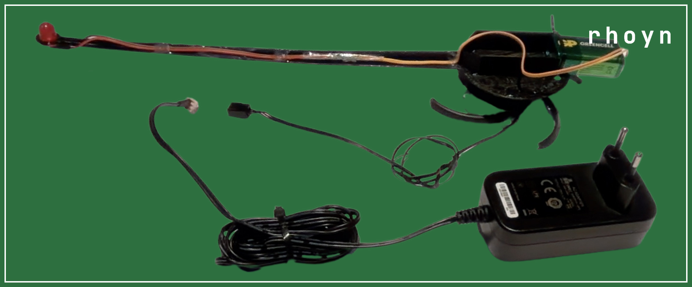

# Rotating diode — bill of materials

Everything needed to build the spinning arm and the motor that turns it.

| # | Part | Notes |
|---|---|---|
| 1 | Printed arm | `rotating_diode.stl`, or `rotating_diode_left.stl` + `rotating_diode_right.stl` glued at the cut plane for smaller beds |
| 2 | 10 mm red LED | Press-fits the 10.5 mm hole at the tip of the arm; this is the blob the program tracks |
| 3 | Resistor, 270 Ω | 5-band, red-violet-black-black-brown (2-7-0, x1, +/-1%). In series with the LED |
| 4 | 9 V battery | Rides in the walled pocket on the disk and turns with it, so no slip ring is needed |
| 5 | 9 V battery clip | Snap connector, wires run along the arm to the LED |
| 6 | 120 x 120 mm fan | The motor — see below |
| 7 | 12 V DC power supply | Drives the fan. A barrel-jack adapter with a fan connector, or any 12 V supply wired to the fan's two power leads |
| 8 | Glue and tape | To bond the arm to the fan hub and dress the LED wiring down the arm |

## The motor

The fan is used as a bare motor, not as a fan:

1. Cut away the square frame, leaving the hub and its spider.
2. Remove the blades from the hub.
3. Glue the bottom of the printed disk to the hub.

Powered from the 12 V supply, the hub spins the arm. The speed doesn't need to
be set or known — it's measured from the video, and only has to stay steady
across a single clip.

## The LED circuit

Battery -> clip -> 270 Ω resistor -> LED -> back to the battery. At 9 V with a
red LED that's roughly 26 mA, which is bright enough to saturate in the
recordings while staying inside a 10 mm LED's rating. The whole circuit rotates
with the arm, so nothing has to be fed across the rotating joint.

